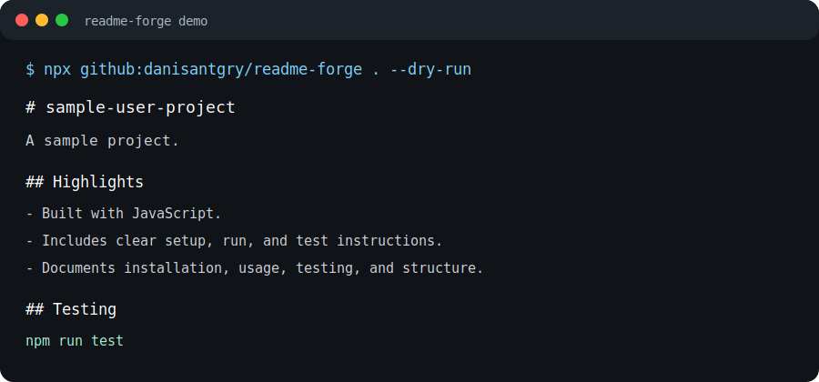

# readme-forge

[](https://github.com/danisantgry/readme-forge/releases)
[](LICENSE)
[](https://github.com/danisantgry/readme-forge/issues)
[](#install)

`readme-forge` is a TypeScript CLI that inspects a project folder and generates a clean, practical `README.md`. It works offline with local templates and can optionally ask Gemini to refine the output when `GEMINI_API_KEY` is present.



## Why It Exists

Many open-source projects have useful code but incomplete onboarding. `readme-forge` helps maintainers keep project documentation accurate by generating README drafts from real repository metadata instead of blank-page guessing.

## Quick Try

Preview a README for the current folder without writing files:

```bash
npx github:danisantgry/readme-forge . --dry-run
```

Check whether an existing README is missing common maintainer sections:

```bash
npx github:danisantgry/readme-forge . --check
```

## Features

- Detects project name, description, scripts, package manager, TypeScript, Vite, Next.js, React, Express, Python, Rust, and Go markers.
- Generates setup, scripts, testing, structure, and license sections.
- Supports custom output paths.
- Supports `cli`, `library`, and `web` template presets.
- Optional Gemini enhancement through environment variables only.
- Never stores API keys in generated files.
- Designed for maintainer workflows where README updates should be repeatable, reviewable, and safe.

## Install

Run directly from GitHub:

```bash
npx github:danisantgry/readme-forge . --dry-run
```

After npm publication:

```bash
npx readme-forge .
```

For local development:

```bash
npm install
npm run build
```

## Usage

Generate or replace `README.md`:

```bash
npm run dev -- .
```

Write to a separate file:

```bash
npm run dev -- . --output README.generated.md
```

Preview without writing:

```bash
npm run dev -- . --dry-run
```

Check README quality:

```bash
npm run dev -- . --check
```

Use a template preset:

```bash
npm run dev -- . --template cli
npm run dev -- . --template library
npm run dev -- . --template web
```

Use Gemini refinement:

```bash
set GEMINI_API_KEY=your-key
npm run dev -- . --ai
```

Optional model override:

```bash
set GEMINI_MODEL=gemini-2.5-flash-lite
```

## Safety

The CLI reads project metadata and writes only the requested README output. API keys are read from the environment and are not written to disk.

## Example Output

See [`examples/node-library/README.generated.md`](examples/node-library/README.generated.md) for a generated README from a small TypeScript package.

## Maintainer Workflow

`readme-forge` is intended to support:

- first-pass README drafts for new repositories
- recurring README updates before releases
- contributor-friendly documentation reviews
- optional AI refinement without making AI required for the project

## Feedback Wanted

If you maintain an open-source project, feedback is especially useful on:

- README sections that should be checked by `--check`
- ecosystem metadata that should be detected next
- generated output that feels too generic or misses important context

Open feedback in [issue #5](https://github.com/danisantgry/readme-forge/issues/5).

## Roadmap

- npm publication under the `readme-forge` package name.
- More framework detectors for Rust, Go, Python, and package-manager-specific workflows.
- README templates for libraries, CLIs, and web apps.
- npm publishing and release workflow documentation.
- README quality checks for missing install/test/license sections.

## Contributing

Contributions are welcome. Start with [`CONTRIBUTING.md`](CONTRIBUTING.md), and use the issue templates for bug reports or feature proposals.

## License

MIT
